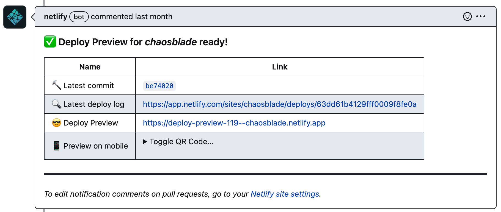

<p align="center">
  
</p>
<h1 align="center">Website</h1>

[](https://app.netlify.com/sites/chaosblade/deploys)
[](LICENSE)
[](https://github.com/chaosblade-io/chaosblade/blob/master/CONTRIBUTING.md)

This repo contains the website configuration and documentation powering the [ChaosBlade website](https://chaosblade.io/).

## Contents

- [Getting started](#getting-started)
- [Overview](#overview)
- [Website configuration](#website-configuration)
- [Contributing](#contributing)
- [License](#license)

## Getting started

### Prerequisites

1. [Git](https://git-scm.com/downloads).
1. [Node](https://nodejs.org/en/download/) _(version 16.14 or greater)_.
1. [Yarn](https://yarnpkg.com/lang/en/docs/install/) _(version 1.5 or greater)_.
1. A fork of the repo _(for any contributions)_.
1. A clone of the `chaosblade-website` repo.

### Installation

1. `cd chaosblade-website` to go into the project root.
1. Run `yarn` to install the website's workspace dependencies.

### Running locally

1. `yarn run start` to start the development server _(powered by [Docusaurus](https://v2.docusaurus.io))_.
1. Open http://localhost:3000/ site in your favorite browser.

## Overview

If you would like to **_contribute an edit or addition to the docs,_** read through our [contributing guide](CONTRIBUTING.md) before you write anything.
Almost all our content is generated from markdown files you can find in the `docs`, `blog` and `i18n` directories.

**_To edit the internals of how the site is built,_** you may want to get familiarized with how the site is built. The ChaosBlade website is a static site generated using [Docusaurus](https://docusaurus.io/).
The website configuration can be found in the `docusaurus.config.js` file. Visit the Docusaurus website to learn more about all the available configuration options.

### Directory Structure

The following is a high-level overview of relevant files and folders.

```
chaosblade-website
├── .github/
│   ├── [GITHUB CONFIG]
│   └── ...
├── docs/
│   ├── [BASE VERSIONED DOC FILES]
│   └── ...
├── blog/
│   ├── [BLOG POSTS]
│   └── ...
├── src/
│   ├── css/
│   │   ├── [CUSTOM STYLES]
│   │   └── ...
│   ├── pages/
│   │   ├── [STATIC PAGES]
│   │   └── ...
│   └── theme/
│   │   ├── [SWIZZLED COMPONENTS]
│   │   └── ...
│   └── data.js
├── static/
│   └── img/
├── docusaurus.config.js
├── package.json
└──  sidebars.json
```

## Website configuration

The main config file for the website can be found at `docusaurus.config.js`. This file tells [Docusaurus how to build the website](https://v2.docusaurus.io/docs/configuration). Edits to this file are rarely necessary.

The `src/pages` subdirectory contains the React components that make up the non-documentation pages of the site, such as the homepage.

The `src/theme` subdirectory contains the swizzled React components from the Docusaurus theme.

The `data.json` file contains the users who use ChaosBlade.

### Tagging a new version

1. First, make sure the current docs version (the `./docs` directory) is ready to be frozen.
2. Enter a new version number.

```shell
yarn docusaurus docs:version 1.1.0
```

When tagging a new version, the document versioning mechanism will:

- Copy the full `docs/` folder contents into a new `versioned_docs/version-[versionName]/` folder.
- Copy the full `i18n/zh/docusaurus-plugin-content-docs/current` folder contents into a new `i18n/zh/docusaurus-plugin-content-docs/version-[versionName]`.
- Copy `i18n/zh/docusaurus-plugin-content-docs/current.json` file contents into a new `i18n/zh/docusaurus-plugin-content-docs/version-[versionName].json`.
- Create a versioned sidebars file based from your current [sidebar](https://docusaurus.io/docs/docs-introduction#sidebar) configuration (if it exists) - saved as `versioned_sidebars/version-[versionName]-sidebars.json`.
- Append the new version number to `versions.json`.

## Contributing

### Fork the repository

Fork the repository and clone it locally. Connect your local to the original “upstream” repository by adding it as a remote. Pull in changes from “upstream” often so that you stay up to date so that when you submit your pull request, merge conflicts will be less likely. (See more detailed instructions [here](https://docs.github.com/en/pull-requests/collaborating-with-pull-requests/working-with-forks/syncing-a-fork).)

### Create a branch

1. `git checkout main` from any folder in your local `chaosblade-website` repository.
1. `git pull origin main` to ensure you have the latest main code.
1. `git checkout -b the-name-of-my-branch` to create a branch.
   > replace `the-name-of-my-branch` with a suitable name, such as `update-animations-page`

### Make the change

1. Follow the "[Running locally](#running-locally)" instructions.
1. Save the files and check in the browser.
1. Some changes may require a server restart to generate new files. (Pages in `docs` always do!)
1. Edits to pages in `docs` will only be visible in the latest version of the documentation, called "Next", located under the `docs/next` path.

Visit **http://localhost:3000/docs/next/YOUR-DOCS-PAGE** to see your work.

### Push it

1. `git add -A && git commit -m "My message"` to stage and commit your changes.
   > replace `My message` with a commit message, such as `Fixed header logo on Android`
1. `git push my-fork-name the-name-of-my-branch`
1. [Make a Pull Request](https://makeapullrequest.com/).

### Preview

When your Pull Request is created successfully, netlify will generate a preview page for you, please check your changes in the preview page.



## License

ChaosBlade documentation is [CC-BY-4.0 licensed](./LICENSE).
