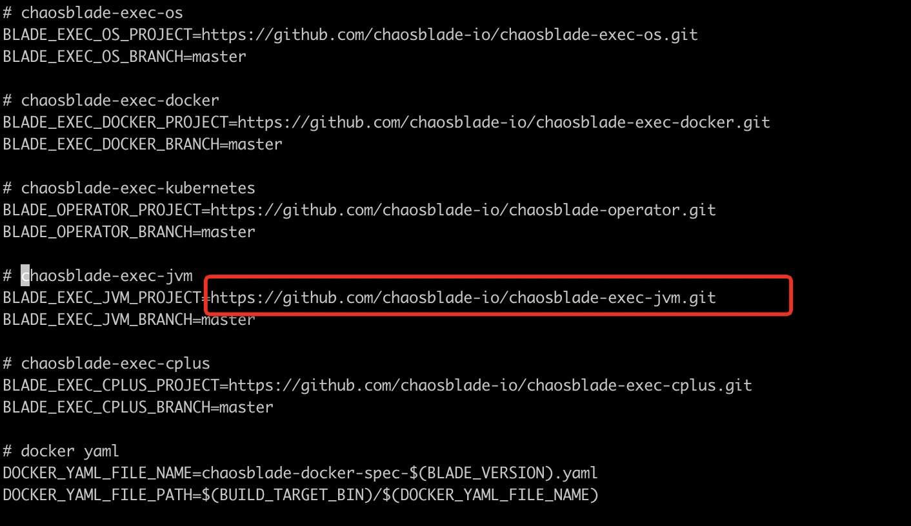
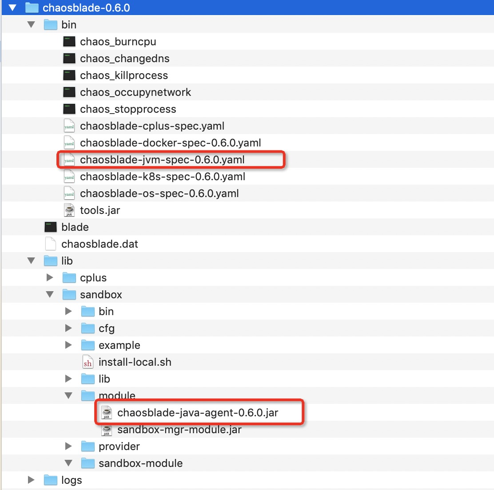

# 开发实战

本篇介绍 `chaosblade-exec-jvm` 如何从零开始如何开发一个组件故障场景。

## 构思步骤

- 新建工程
- 定义模型
- 定义合适的切点
- 定义`Enhancer`增强类
- 定义`ActionExecutor`
- 定义`plugin`

## Lettuce故障场景

`Lettuce`是一个基于`netty`异步通信的`redis`客户端，本篇开发`lettuce plugin`，对自定义输入匹配的key实现：

- `string`值类型的值篡改

- 延迟

- 自定义异常抛出

#### 新建工程

按插件的规范，在`chaosblade-exec-plugin`模块下新建工程`chaosblade-exec-plugin-lettuce`。

#### 定义模型

这里继承了`FrameworkModelSpec`类，`FrameworkModelSpec`类默认包含了延迟和自定义异常的故障能力，下面介绍如何篡改值。

- `getTarget()`实现的靶点。
- `getShortDesc() `描述
- `getLongDesc()`描述
- `getExample()`例子

````java
public class LettuceModeSpec extends FrameworkModelSpec {

    @Override
    protected List<MatcherSpec> createNewMatcherSpecs() {
        // todo
        return null;
    }

    @Override
    public String getTarget() {
        return "lettuce";
    }

    @Override
    public String getShortDesc() {
        return "redis client lettuce experiment";
    }

    @Override
    public String getLongDesc() {
        return "redis client lettuce experiment";
    }

    @Override
    public String getExample() {
        return "lettuce --key=name update --value=meepo";
    }
}
````

`lettuce --key=name update --value=meepo` 

- `lettuce`作为实验的靶点， 
- `update`是实验的动作，具体可参数模型篇。

- `--key` 模型中的 matchers，实验规则匹配器，`KeyMatcherSpec`继承`BasePredicateMatcherSpec`，会`required()`判断是是否是必输字段。

- `--value`模型中 action 参数，指`update`需要更新成这个值。

```java
public class KeyMatcherSpec extends BasePredicateMatcherSpec {

    @Override
    public String getName() {
      	// --key
        return "key";
    }

    @Override
    public String getDesc() {
        return "key matcher";
    }

    @Override
    public boolean noArgs() {
        return false;
    }

    @Override
    public boolean required() {
      	// 是否必输
        return true;
    }
}
```

```java
public class ValueFlagSpec implements FlagSpec {

    @Override
    public String getName() {
        return "value";
    }

    @Override
    public String getDesc() {
        return "value set";
    }

    @Override
    public boolean noArgs() {
        return false;
    }

    @Override
    public boolean required() {
        return false;
    }
}
```
在`UpdateAction`里面添加`ValueFlagSpec` 和`LettuceActionExecutor`,`LettuceActionExecutor`是实验`upadte`的执行阶段，后面介绍。
```java
public class UpdateActionSpec extends BaseActionSpec {

    private static ValueFlagSpec valueFlagSpec = new ValueFlagSpec();

    public UpdateActionSpec() {
        super(new LettuceActionExecutor(valueFlagSpec));
    }

    @Override
    public String getName() {
        return "update";
    }

    @Override
    public String[] getAliases() {
        return new String[0];
    }

    @Override
    public String getShortDesc() {
        return "update action spec";
    }

    @Override
    public String getLongDesc() {
        return "update action spec";
    }

    @Override
    public List<FlagSpec> getActionFlags() {
        List<FlagSpec> flagSpecs = new ArrayList<FlagSpec>();
        flagSpecs.add(valueFlagSpec);
        return flagSpecs;
    }

    @Override
    public PredicateResult predicate(ActionModel actionModel) {
        if (StringUtil.isBlank(actionModel.getFlag(valueFlagSpec.getName()))) {
            return PredicateResult.fail("less value argument");
        }
        return PredicateResult.success();
    }
}
```

然后在`LettuceModeSpec`中的`createNewMatcherSpecs()`方法中添加`UpdateActionSpec`和`ValueMatcherSpec`即可。

````java
    @Override
    public List<MatcherSpec> createNewMatcherSpecs() {
        addActionSpec(new UpdateActionSpec());
        List<MatcherSpec> matchers = new ArrayList<MatcherSpec>();
        matchers.add(new KeyMatcherSpec());
        return matchers;
    }
````

#### 定义切点

定义切点需要找到合适的切点，`Lettuce`基于`netty`异步通信，所有的命令都在`io.lettuce.core.protocol.CommandHandler#write`

方法中发出。`ClassMatcher`和`MethodMatcher`还有更多的匹配方式可参考插件篇

````java
public class LettucePointCut implements PointCut {

    @Override
    public ClassMatcher getClassMatcher() {
        NameClassMatcher nameClassMatcher = new NameClassMatcher("io.lettuce.core.protocol.CommandHandler");
        return nameClassMatcher;
    }

    @Override
    public MethodMatcher getMethodMatcher() {
        NameMethodMatcher nameMethodMatcher = new NameMethodMatcher("write");
        return nameMethodMatcher;
    }
}
````

#### 定义`Enhancer`

`Enhancer`获取`io.lettuce.core.protocol.CommandHandler#write()`方法第二个参数的值，这里为了演示，先只支持几个简单命令，先获取命令的类型，如果不是`SET`、`SETNX`、`HSET`类型`return null`故障能力就中断了，然后获取`key`在`Inject`阶段匹配。

```java
public class LettuceEnhancer extends BeforeEnhancer {

    private static final Logger logger = LoggerFactory.getLogger(LettuceEnhancer.class);

    private static final  List<String> SUPPORTS_COMMANDS = new ArrayList<String>();

    static {
        SUPPORTS_COMMANDS.add("SET");
        SUPPORTS_COMMANDS.add("SETNX");
        SUPPORTS_COMMANDS.add("HSET");
    }

    @Override
    public EnhancerModel doBeforeAdvice(ClassLoader classLoader,
                                        String className,
                                        Object object,
                                        Method method,
                                        Object[] methodArguments) throws Exception {

        Object command = methodArguments[1];
        Object args = ReflectUtil.getFieldValue(command, "command", false);

        Object commandType = ReflectUtil.getFieldValue(args, "type", false);
        if (!SUPPORTS_COMMANDS.contains(String.valueOf(commandType))) {
            return null;
        }

        Object commandArgs = ReflectUtil.getFieldValue(args, "args", false);
        List singularArguments = ReflectUtil.getFieldValue(commandArgs, "singularArguments", false);
        Object keyArgument = singularArguments.get(0);

        MatcherModel matcherModel = new MatcherModel();
        if (keyArgument == null) {
            return null;
        }
        Object key = ReflectUtil.getFieldValue(keyArgument, "key", false);
        matcherModel.add("key", key);
        logger.debug("lettuce matchers: {}", JSON.toJSONString(matcherModel));
        return new EnhancerModel(classLoader, matcherModel);
    }
}
```

#### 定义`ActionExecutor`

`LettuceActionExecutor`执行更新值。

```java
public class LettuceActionExecutor implements ActionExecutor {

    private static final Logger logger = LoggerFactory.getLogger(LettuceEnhancer.class);

    private ValueFlagSpec valueFlagSpec;

    public LettuceActionExecutor(ValueFlagSpec valueFlagSpec) {
        this.valueFlagSpec = valueFlagSpec;
    }

    @Override
    public void run(EnhancerModel enhancerModel) throws Exception {
        Object command = enhancerModel.getMethodArguments()[1];
        Object args = ReflectUtil.getFieldValue(command, "command", false);
        Object commandArgs = ReflectUtil.getFieldValue(args, "args", false);
        List singularArguments = ReflectUtil.getFieldValue(commandArgs, "singularArguments", false);

        Object valArgument = singularArguments.get(1);
        Object originVal = ReflectUtil.getFieldValue(valArgument, "val", false);
        if (!(originVal instanceof String)) {
            logger.info("not support value, value type: {}", originVal.getClass());
            return;
        }

        Object codec = ReflectUtil.getFieldValue(valArgument, "codec", false);

        String value = enhancerModel.getActionFlag(valueFlagSpec.getName());
        Object[] arguments = new Object[]{value, codec};
        Object valueArgument = ReflectUtil.invokeStaticMethod(valArgument.getClass(), "of", arguments, false);

        if (valueArgument != null) {
            logger.info("update value success. origin value: {}, update value: {}", originVal, value);
          	// 更新原来的值
            singularArguments.set(1, valueArgument);
        }
    }
}
```

#### 定义`plugin`

定义`plugin`添加模型、`PointCut`、`Enhancer`，并且在当前工程`resources`新建文件`resources/META-INF/services/com.alibaba.chaosblade.exec.common.aop.Plugin`，把自定义`plugin`的全限定名复制到文件里面`com.alibaba.chaosblade.exec.plugin.lettuce.LettucePlugin`即可，此时一个插件就开发完成了。

```java
public class LettucePlugin implements Plugin {

    @Override
    public String getName() {
        return "lettuce plugin";
    }

    @Override
    public ModelSpec getModelSpec() {
        return new LettuceModeSpec();
    }

    @Override
    public PointCut getPointCut() {
        return new LettucePointCut();
    }

    @Override
    public Enhancer getEnhancer() {
        return new LettuceEnhancer();
    }
}
```

**注意：** `Lettuce command`支持很多不同的类型`codec`，本次开发实战为了演示，只支持`RedisCommands<String, String>`，否则不支持篡改。也不支持`batch command`模式。

## 打包和执行

### 准备

#### 方式一

首先提交代码push到自己的仓库、需要`go`、`java_home` 、`maven`

- clone 

````shell script
git clone https://github.com/chaosblade-io/chaosblade
````

- 修改Makefile

````shell script
cd chaosblade
vi Makefile
````

把`Makefile`里面的`BLADE_EXEC_JVM_PROJECT`改成修改成你fork的仓库地址，保存退出


- 编译

````shell script
// linux
make build_linux
// macos
make build_darwin
````

#### 方式二

如果已经下载了`chaosblade`relase包可以使用此方式，在`chaosblade-exec-jvm`目录下编译打包，需要`java_home` 、`maven`

````java
make build
````

编译成功后，在当前目录生成如下`yml`和`jar`

- `plugins/chaosblade-jvm-spec-0.6.0.yaml`
- `build-target/chaosblade-0.6.0/lib/sandbox/module/chaosblade-java-agent-0.6.0.jar`

**分别将`yml`和`jar`替换到如下图的`chaosblade`目录下：**


### 混沌实验

- 挂载`agent`：`--pid 3356` 是被攻击应用的jvm进程号，每次挂载对应一个 uid，卸载agent的时候需要uid

````shell script
./blade prepare jvm --pid 3356
````

- 创建混沌实验

````shell script
./blade c lettuce --key=name update --value=tiny
````


- 销毁

````shell script
./blade create destroy 863c8c5a2c2c3deb
````

### 卸载agent

````shell script
./blade destroy 6a0863a4f0da8a38
````

